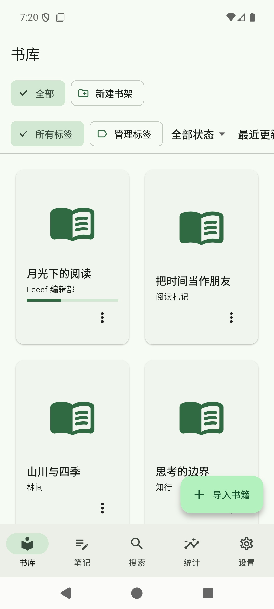
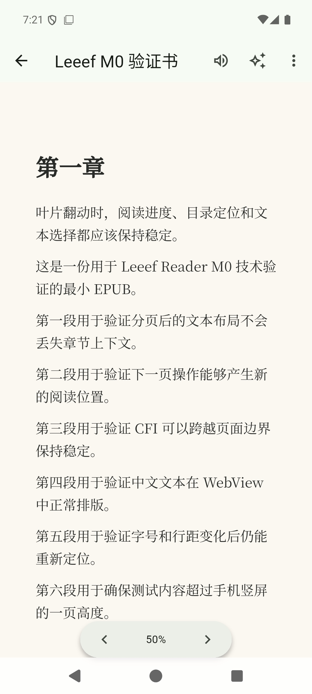
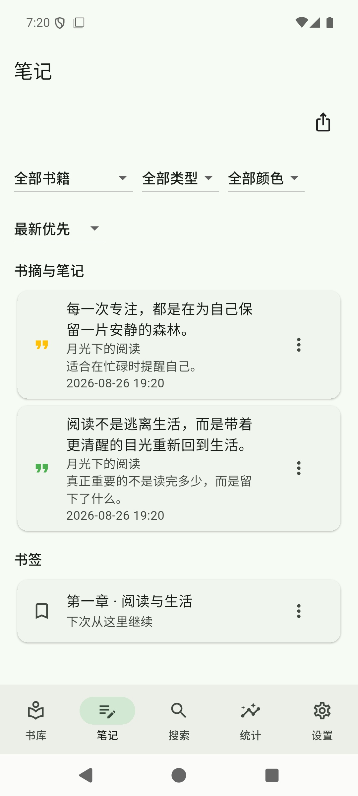

<h1> Leeef Reader</h1>

[](https://github.com/tianma-if/leeef-reader/stargazers)
[](https://github.com/tianma-if/leeef-reader/network/members)
[](https://github.com/tianma-if/leeef-reader/releases/latest)
[](LICENSE)
[](https://afdian.com/a/tianma-if)

[简体中文](README.zh-CN.md) | English

> **Leeef Reader: An open-source, offline-first ebook reader with native MCP and finger-following page turns.**

Leeef Reader is a local-first ebook app for people who want their library, progress, and notes on their own machine. Import a book and start reading with no Leeef account. When you want AI or agents in the loop, bring your own endpoint—or start the built-in MCP server so tools such as Claude Code and Codex can query the same SQLite library the app uses.

> 💡 **Your books stay on your device**
> Leeef does not require a Leeef cloud or a Leeef login. Files, shelves, excerpts, and reading progress live in a local `leeef.sqlite` database you can inspect. Optional object storage and AI credentials are yours, filled in on the desktop.

> ⭐ If Leeef Reader is useful to you, consider giving it a Star. Your support helps more people find an ebook reader that does not sit behind a store account.

## Why Leeef

Most of us already have a folder of EPUBs, PDFs, and Chinese TXT novels. The usual options all take something away:

- **Kindle and other store readers**: Convenient, but the library, highlights, and often the files themselves live in someone else's catalog. Export is an afterthought.
- **Apple Books**: Fine inside one company's devices. There is no MCP, no bring-your-own model, and no path for an agent to organize the shelf.
- **Commercial reading apps**: Feeds, rankings, and ads compete with the book. Your files are not the product.
- **Many open-source readers**: Strong on desktop formats, weaker on a phone page-turn that follows the finger, and rarely a first-class way for an AI agent to read the same library.

**Leeef is built for that gap**: a system WebView reader with captured-slide paging on the phone, a SQLite library that MCP and in-app AI both speak, and no mandatory account.

> 💡 **A practical setup:**
> Keep the library on the computer, fill in an OpenAI-compatible endpoint when you want chat, and start MCP when an agent should search books, excerpts, or progress. On the phone, import and read; credentials stay off the mobile settings form and arrive later through pairing.

## Screenshots

<p align="center">
  
  &nbsp;
  
  &nbsp;
  
</p>

## Downloads

Current GitHub Releases ship **signed** macOS and Android installers. Google Play uses the same Android package.

<p>
  <a href="https://github.com/tianma-if/leeef-reader/releases/latest"></a>&nbsp;&nbsp;
  <a href="https://github.com/tianma-if/leeef-reader/releases/latest"></a>&nbsp;&nbsp;
  <a href="https://play.google.com/store/apps/details?id=dev.leeef.leeef_reader"></a>
</p>

- **macOS**: universal DMG / ZIP from [GitHub Releases](https://github.com/tianma-if/leeef-reader/releases/latest) (Developer ID signed and notarized).
- **Android**: arm64 APK from GitHub Releases, or the Play App Signing AAB on [Google Play](https://play.google.com/store/apps/details?id=dev.leeef.leeef_reader).
- **iOS and Windows** packages are not in the current Release. They are on the roadmap; this README does not treat them as shipped.

The previous Flutter client does not auto-update to this app, and libraries are not migrated automatically.

## Features

- **Offline-first library**: Import EPUB, PDF, TXT, MOBI, AZW3, and FB2. No Leeef account, no ads, no cross-app tracking.
- **Chinese TXT that actually opens**: UTF-8 plus GBK / GB18030 without a BOM, invalid XML stripped, chapters split on 第×章 headings when present.
- **Shelves and tags**: Nested shelves, tags, search, unread / reading / done filters, and metadata editing.
- **System WebView pagination**: Pages lay out with vendored [foliate-js](https://github.com/johnfactotum/foliate-js) in the same WebView as the app chrome—not a remote web app.
- **Finger-following slide on the phone**: Mobile paginated mode captures the outgoing page, jumps the live view underneath, and slides the overlay. Capture failure falls back to a plain next/prev. Desktop paginated mode uses foliate animation; both ends also offer continuous scrolling.
- **Reading chrome you can live with**: Font size, line height, one or two columns, paper / sepia / night, and Simplified / Traditional Chinese conversion.
- **Excerpts, bookmarks, and notes**: Highlights and bookmarks stay attached to the book; the notes tab filters by book, type, and color.
- **Reading stats**: Time spent, days, streak, books finished, and a weekly heatmap.
- **OPDS catalogs**: Browse and download from OPDS feeds you configure.
- **Bring-your-own AI**: Desktop settings take an OpenAI-compatible endpoint, API key, and model (OpenAI, DeepSeek, OpenRouter, xAI, and similar). Chat streams in-process. The model can list and search the local library; writes wait for confirmation.
- **In-process MCP**: Start the library MCP server from Settings. It binds loopback HTTP against the same `leeef.sqlite` the reader uses. Agents can list books, extract text, search excerpts, and apply confirmed writes.
- **Desktop credentials, phone pairing**: Object storage, AI, and similar secrets are filled in on the computer. The phone accepts a one-time LAN pairing code instead of showing those forms, then keeps portable settings synchronized.
- **Open local data**: The library is standard SQLite. Core mutations record a `sync_operation` in the same transaction so a future own-cloud sync has a real log, not a side channel.

## MCP

Leeef speaks [Model Context Protocol](https://modelcontextprotocol.io/) from inside the Tauri process. In Settings, start MCP and point your agent at the printed loopback endpoint with the Bearer token.

Read tools include `list_books`, `search_books`, `get_book`, `get_book_content`, shelves, excerpts, bookmarks, and reading progress. Writes return a plan that must go through `confirm_write` → `apply_write` so an agent cannot mutate the library in one shot.

> 💡 **With an agent:**
> Ask what you were reading last week, pull quotes for a topic, or have the agent file a book onto a shelf after you confirm. MCP uses the same `db.rs` path as the reader—not a second SQLite opener.

## Data, AI, and sync

- Books and reading data stay on the device by default.
- AI is optional and bring-your-own. Keys leave the desktop only when you explicitly pair a trusted device, and the configuration document is encrypted before upload.
- The multi-device model uses **your** S3-compatible bucket or WebDAV. LAN pairing transfers the encrypted sync-space key and the first configuration snapshot; later settings changes converge through per-device encrypted configuration documents. Book and reading-data object synchronization is still being brought onto this Tauri client. See [trusted-device-sync.md](docs/trusted-device-sync.md) for the protocol.

Online features need a network and credentials you supply. Leeef does not sell AI or cloud storage in the app.

## Roadmap

These are not in the current GitHub Release:

- Signed iOS and Windows installers
- Complete S3 / WebDAV book-data sync and add QR scanning to the existing pairing-code flow
- Sparkle (macOS) and Play auto-update

## Tech stack

- **App**: Tauri 2, Vite, React, TypeScript. Chrome uses Tailwind CSS and shadcn/ui; the reading surface stays custom (foliate + captured slide).
- **Reader**: Vendored foliate-js in the system WebView. TXT is converted to EPUB before the same paginator.
- **Native**: `apps/reader/src-tauri` (Rust, rusqlite). Android `PixelCopy` / iOS snapshot live in the `native-bridge` plugin.
- **MCP**: official Rust SDK (`rmcp`) inside `apps/reader/src-tauri`, loopback Streamable HTTP plus a Bearer token.
- **Identifier**: `dev.leeef.leeef-reader` (Android applicationId `dev.leeef.leeef_reader`).

## Quick start

```sh
cd apps/reader
npm install
npm run tauri dev
```

MCP tests:

```sh
cd apps/reader/src-tauri
cargo test --lib
```

Android debug builds must use a **USB device**, not an emulator. See [docs/tauri-reader.md](docs/tauri-reader.md).

## Project structure

```text
apps/reader                 Tauri 2 + Vite + React client
apps/reader/public/vendor/foliate-js
                            Vendored paginator, EPUB/MOBI/FB2/PDF
apps/reader/src-tauri       Rust host, rusqlite, in-process MCP
apps/reader/src-tauri/plugins/native-bridge
                            Page capture and native file pick
docs                        Reader shell and pairing notes
store-assets                Store listings, privacy, screenshots
assets/brand                Logo and mark
.github/workflows           CI and signed GitHub Release jobs
```

## Community

- Bugs and feature requests: [GitHub Issues](https://github.com/tianma-if/leeef-reader/issues)
- Releases: [GitHub Releases](https://github.com/tianma-if/leeef-reader/releases)
- Privacy: [privacy policy](store-assets/privacy-policy.en-US.md)

## Acknowledgements

- EPUB pagination and format adapters use [foliate-js](https://github.com/johnfactotum/foliate-js), vendored in this repository.
- The app chrome uses [shadcn/ui](https://ui.shadcn.com/) and [Tauri](https://tauri.app/).
- Mobile slide page-turns were independently implemented against the public behavior of contemporary WebView readers (capture the outgoing page, jump the live view, overlay the slide).

## Trademark and brand use

The Leeef Reader name, logo, and other brand identifiers distinguish the official project. Forks and modified versions may state that they are based on Leeef Reader, but must not imply official status or mislead users. The open-source license does not grant trademark rights; other uses require prior written permission from the project maintainers.

## Disclaimer

Leeef Reader is an independent open-source application. It is not affiliated with, authorized, sponsored, or endorsed by Amazon, Apple, Google, or any ebook store.

Leeef does not host your library. Content you import is your responsibility. Optional third-party AI, TTS, OPDS, and object-storage services are operated by those providers under their own terms.

## License

[AGPL-3.0](LICENSE)
